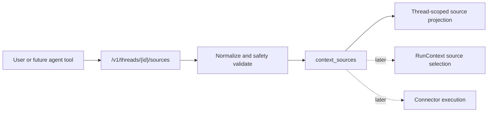

The M32 source registry is intentionally a reference layer, not a connector runtime.

## Model

`context_sources` belongs to one user and one thread. Each row stores:

- stable `src_...` id
- `kind`
- safe `title`
- normalized `locator`
- optional redacted `summary`
- redacted `metadata`
- `registered` status

## Safety

URL locators are public HTTP(S) only. Query strings and fragments are discarded before storage. Localhost, loopback, private network, link-local, multicast, unspecified hosts, and URL credentials are rejected.

Workspace locators are relative paths only. Traversal, absolute paths, `.git`, `.env*`, private keys, `secrets`, and `credentials` are rejected before persistence.

## Future Use

This registry gives later connector work a safe durable anchor for source selection. Fetching, crawling, sync scheduling, source-specific auth, and source-to-RunContext replay should be added as separate slices with their own approval and observability boundaries.
